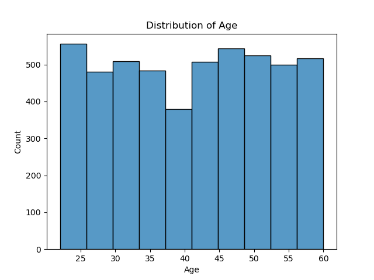
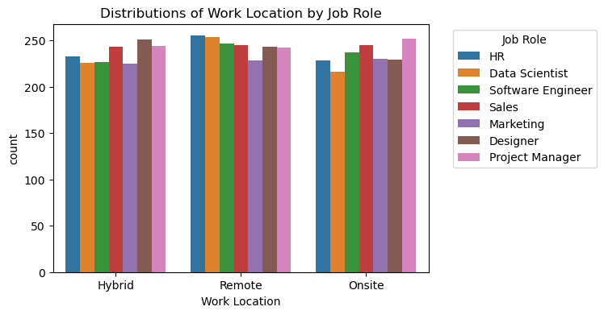
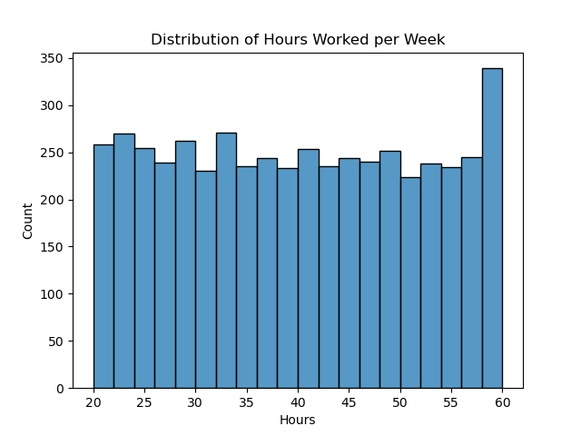
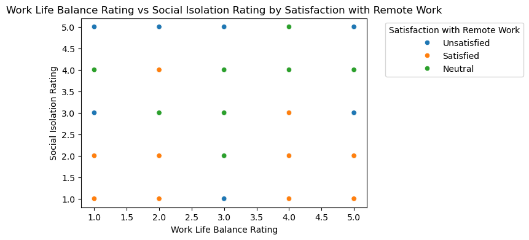
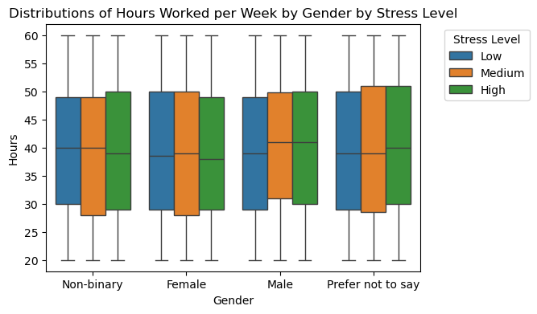
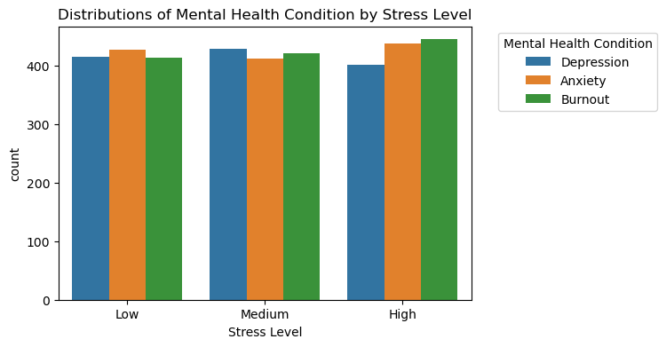
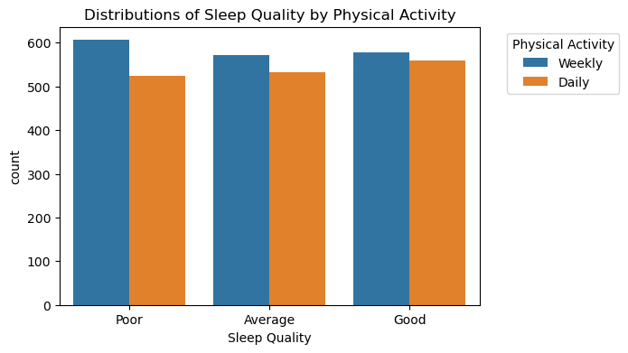
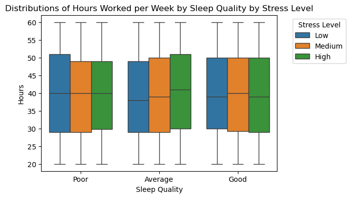

# Remote Work and Mental Health Analysis

## Problem Statement

With the global rise of remote work, particularly accelerated by the COVID-19 pandemic, companies and employees have had to adapt quickly to new ways of working. While remote work offers benefits such as flexibility and reduced commuting time, it also presents potential challenges to mental health, including increased stress, anxiety, and difficulty maintaining work-life balance. Understanding these challenges and their impacts is essential for employers and policymakers who seek to create a supportive work environment.

This project aims to explore the relationships between remote work, mental health indicators, and job satisfaction. By analyzing survey data, we aim to uncover insights into how factors like remote work frequency, job satisfaction, and stress levels interrelate. Our analysis addresses the following questions:

How does the frequency of remote work impact mental health indicators such as stress, anxiety, and work-life balance?
What correlations exist between job satisfaction and remote work?
Are there specific trends or demographic patterns that could inform workplace policies and mental health support initiatives?
The goal of this analysis is to inform strategies that organizations can use to support remote employees' well-being, mitigate mental health risks, and enhance job satisfaction in remote or hybrid work environments.

## Data Dictionary

|       Variable Name               |     Type      | Description                                                                                  |
|-----------------------------------|---------------|----------------------------------------------------------------------------------------------|
| Employee_ID                       | Nominal       | Unique identifier for each employee.                                                         |
| Age                               | Continuous    | The actual age of the employees.                                                             |
| Gender                            | Nominal       | Gender of the employees - Male, Female, Non-binary, Prefer not to say.                       |
| Job_Role                          | Nominal       | The job role of the employees - includes roles like HR, Data Scientist, Sales, etc.          |
| Industry                          | Nominal       | The industry in which the employees work - such as Healthcare, IT, Education, etc.           |
| Years_of_Experience               | Discrete      | Total years of professional experience of the employees.                                     |
| Work_Location                     | Nominal       | The work arrangement of the employees - Hybrid, Remote, or Onsite.                           |
| Hours_Worked_Per_Week             | Continuous    | Average number of hours worked per week by the employees.                                    |
| Number_of_Virtual_Meetings        | Discrete      | Average number of hours worked per week by the employees.                                    |
| Work_Life_Balance_Rating          | Ordinal       | Self-reported rating of work-life balance - High, Medium, Low.                               |
| Stress_Level                      | Ordinal       | Self-reported level of stress - High, Medium, Low.                                           |
| Mental_Health_Condition           | Nominal       | Self-reported mental health condition - Depression, Anxiety, Burnout, or NaN (not disclosed).|
| Access_to_Mental_Health_Resources | Nominal       | Indicates whether the employee has access to mental health resources - Yes or No.            |
| Productivity_Change               | Ordinal       | Change in productivity due to remote work - Decrease, Increase, or No Change.                |
| Social_Isolation_Rating           | Ordinal       | Self-reported rating of social isolation - ranging from 1 to 5.                              |
| Satisfaction_with_Remote_Work     | Ordinal       | Employee satisfaction with remote work - Unsatisfied, Satisfied, or Neutral.                 |
| Company_Support_for_Remote_Work   | Ordinal       | Level of company support for remote work - ranging from 1 to 5.                              |
| Physical_Activity                 | Ordinal       | Frequency of physical activity - Daily, Weekly, or NaN (not disclosed).                      |
| Sleep_Quality                     | Ordinal       | Self-reported sleep quality - Good, Average, or Poor.                                        |
| Region                            | Nominal       | Geographic region of the employees - Europe, Asia, North America, South America, Oceania, or Africa.|

## Executive Summary

### Data Cleaning Steps

The data cleaning process began by identifying missing values in each column and filling them with appropriate replacements, such as "None" for categorical fields like Mental_Health_Condition and Physical_Activity. After confirming the data types of each variable, we verified that all columns were in the correct format for analysis. Outliers were then assessed using a boxplot on key numerical variables—such as Age, Years_of_Experience, Hours_Worked_Per_Week, Number_of_Virtual_Meetings, Work_Life_Balance_Rating, Social_Isolation_Rating, and Company_Support_for_Remote_Work—and no significant outliers were found. For categorical fields, we checked unique values to ensure consistency in categories (e.g., Gender, Job_Role, Industry, Work_Location, Stress_Level).

To prepare for analysis, categorical variables were then mapped to numerical values. Mappings were applied to fields such as Gender, Job_Role, Industry, Stress_Level, and others, converting these fields to a numerical format. After this transformation, a final check confirmed that no missing values remained. The Employee_ID column was dropped, as it was not needed for analysis, and the cleaned dataset was saved to train_cleaned.csv for further processing.

### Key Visualizations

#### Visualization 1: [Age Distribution]
[The histogram displays the distribution of ages among the dataset. The data is evenly distributed throughout the entire range of ages.]

#### Visualization 2: [Bar Graph of Work Location by Job Role]
[The bar graph displays the distribution of work location by job role. The graph shows that most employees are working remotely, followed by hybrid, and finally onsite with the least amount of employees. The distribution of job roles is evenly distributed within work locations.]

#### Visualization 3: [Hours Worked per Week Distribution]
[The histogram shows the distribution of hours worked per week within the dataset, with the data evenly spread across most hours with a slight uptick near 60 hours worked per week.]

#### Visualization 4: [Scatterplot of Work Life Balance Rating vs Social Isolation Rating]
[The scatterplot displays the relationship between work life balance rating and social isolation rating by satisfaction with remote work. Although the data is scattered, there is a general trend associated with unsatisfied with remote work and a high social isolation rating along with a cluster of employees that rate their work life balance highly with a low social isolation rating being satisfied with remote work.]

#### Visualization 5: [Boxplots of Hours Worked per Week by Gender]
[The side-by-side boxplots illustrate the distribution of hours worked per week by gender and stress level. The data reveals that men tend to work more hours on average each week, with a significant number reporting medium to high stress levels.]

#### Visualization 6: [Bar Graph of Stress Level by Mental Health Condition]
[The bar graph displays the distribution of employees' stress levels by mental health condition. The graph shows that as employees' stress increases, their burnout and anxiety also increases.]

#### Visualization 7: [Bar Graph of Sleep Quality by Physical Activity]
[The bar graph displays the distribution of employees' sleep quality by physical activity. The graph shows that most employees get poor sleep.]

#### Visualization 8: [Boxplots of Hours Worked per Week by Sleep Quality]
[The side-by-side boxplots illustrate the distribution of hours worked per week by sleep quality and stress level. The data reveals that employees who get an average amount of sleep show having high stress levels over poor and good sleep qualities.]

## Model Performance

### Model Selection

In this machine learning project, we worked to predict "Stress_Level" based on various features. After confirming a balanced class distribution, the dataset was split into training and testing sets and standardized the features. The data was initially trained on a K-Nearest Neighbors (KNN) classifier, achieving about 55% accuracy on the training set and 34% on the test set. Different values of k were experimented with to optimize performance and compared KNN with Logistic Regression and Random Forest models. While Logistic Regression had a test accuracy of around 34% and Random Forest overfitted (100% training accuracy but only 32.72% on the test set), the goal remained to develop a model with an accuracy exceeding the baseline of 32.90%. It's planned to further optimize hyperparameters and explore additional classifiers to improve results.

## Conclusions/Recommendations

Our analysis reveals significant trends in employee work habits, mental health, and satisfaction, especially within the remote work environment. Key findings show a balanced distribution of work hours, though some employees approach or exceed 60 hours per week, indicating potential overwork. A preference for remote work and the need for flexible arrangements emerged, along with a notable link between work-life balance ratings, social isolation, and stress. Male employees tend to work longer hours and report higher stress levels, highlighting a need for targeted mental health support. Additionally, employees with average sleep quality experience more stress than those with poor or good sleep quality, emphasizing the potential benefits of sleep hygiene initiatives.

In response, organizations should monitor employee work hours to prevent burnout, maintain flexible work options, and develop targeted stress management programs. Increased accessibility to mental health resources is crucial, especially for high-stress roles, alongside regular monitoring of employee well-being metrics like sleep quality and satisfaction. Future steps include longitudinal studies on remote work’s impact, stress management training, and ongoing evaluation to support employee productivity and mental health in the evolving workplace.